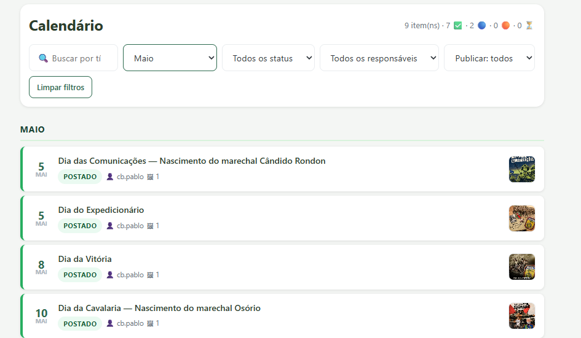
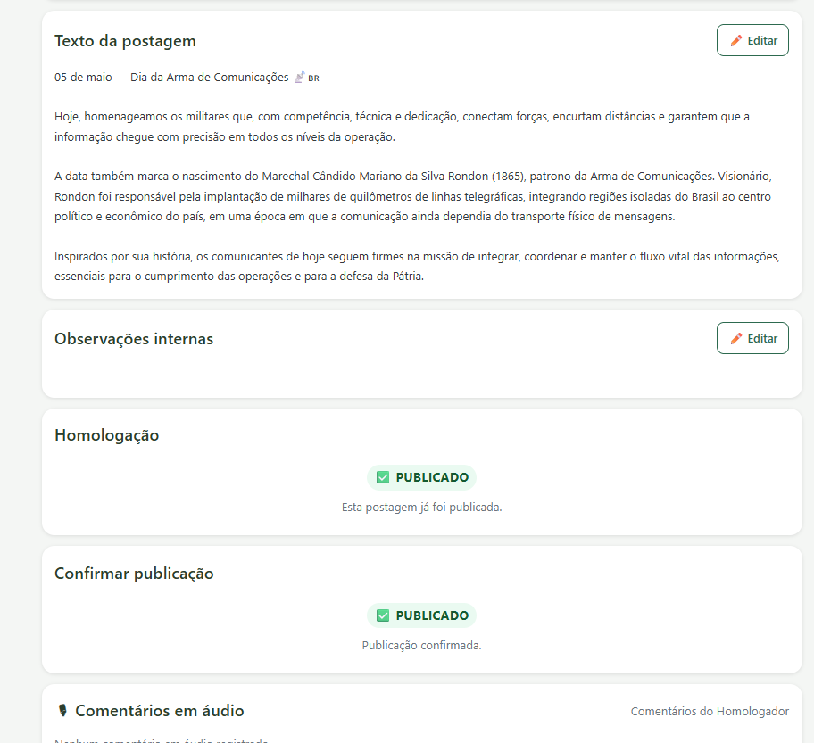
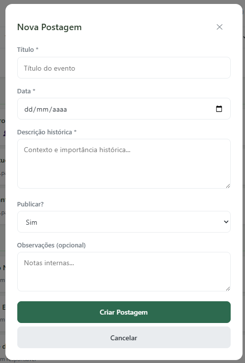
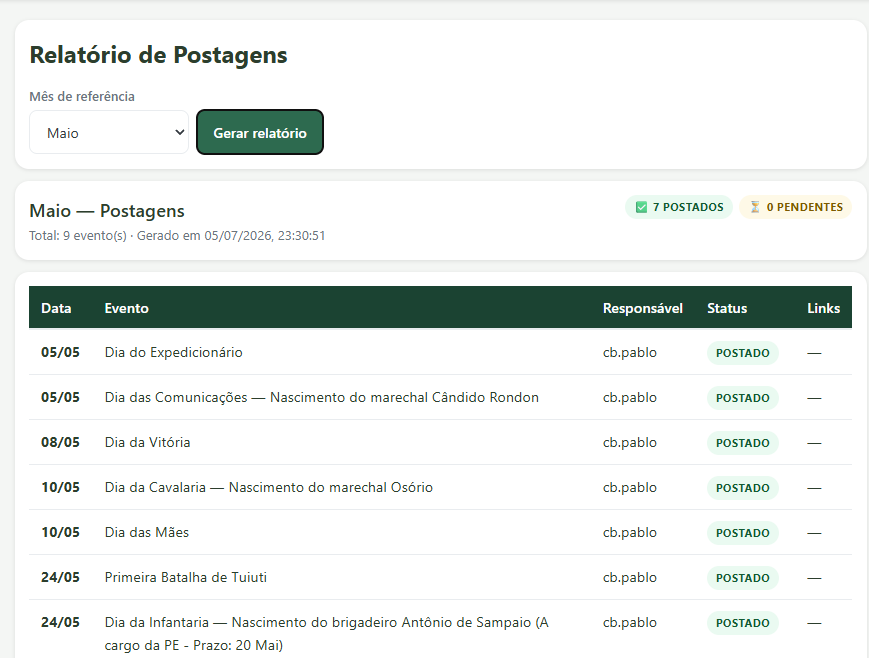
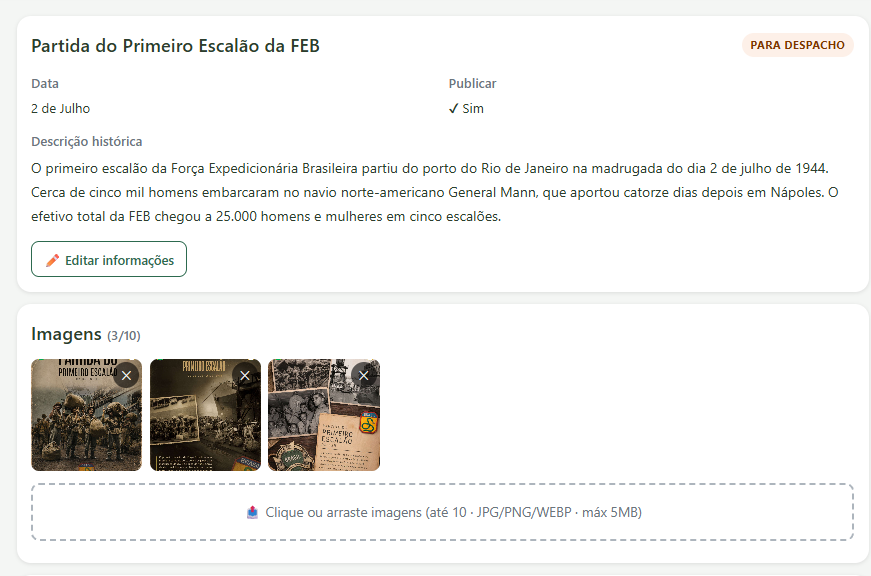

# Efemérides

Sistema para planejamento, controle e registro de postagens institucionais em redes sociais, voltado à gestão de datas históricas e representativas previstas na **Cartilha de Datas Históricas e Representativas do DPHCEx**, além de outras datas cadastradas pela própria organização.

O objetivo é centralizar o fluxo de produção das publicações, desde a identificação da efeméride até o registro do link da postagem efetivamente publicada.

---

## Funcionalidades

* Cadastro e consulta de efemérides institucionais;
* Importação ou registro manual de datas previstas na Cartilha de Datas Históricas e Representativas do DPHCEx;
* Cadastro de datas complementares, locais ou específicas da organização;
* Visualização das efemérides por calendário, mês, período ou responsável;
* Criação de postagens vinculadas a uma data comemorativa;
* Inserção e edição de textos para redes sociais;
* Inclusão de imagens, artes e outros arquivos de apoio;
* Registro de despacho, observações e orientações para a produção;
* Definição de responsáveis pela elaboração, revisão, aprovação e publicação;
* Fluxo de aprovação das postagens;
* Acompanhamento do status de cada publicação;
* Registro da data de publicação e do link da postagem publicada;
* Consulta ao histórico de alterações e publicações realizadas.

---

## Fluxo de Trabalho

```text
Efeméride cadastrada
        ↓
Criação da postagem
        ↓
Elaboração de texto e arte
        ↓
Despacho / revisão
        ↓
Aprovação
        ↓
Publicação nas redes sociais
        ↓
Registro do link e conclusão
```

---

## Status das Postagens

| Status               | Descrição                                                            |
| -------------------- | -------------------------------------------------------------------- |
| Pendente             | A efeméride foi identificada, mas a postagem ainda não foi iniciada. |
| Em elaboração        | Texto, arte ou demais materiais estão em produção.                   |
| Em revisão           | A postagem aguarda análise, despacho ou ajustes.                     |
| Aguardando aprovação | O material está finalizado e depende de aprovação.                   |
| Aprovada             | A postagem está autorizada para publicação.                          |
| Publicada            | A publicação foi realizada e possui registro do link.                |
| Cancelada            | A postagem não será publicada.                                       |

---

## Informações Registradas

Cada efeméride pode reunir informações como:

* Nome da data ou evento;
* Data de celebração;
* Categoria;
* Origem da referência;
* Descrição ou contexto histórico;
* Prioridade da publicação;
* Redes sociais previstas;
* Responsáveis envolvidos;
* Texto da postagem;
* Imagens e artes;
* Despachos e observações;
* Situação da aprovação;
* Data e horário da publicação;
* Link da postagem publicada.

---

## Objetivos do Sistema

* Evitar a perda de prazos relacionados a datas institucionais;
* Padronizar o processo de criação e aprovação de postagens;
* Facilitar a distribuição de responsabilidades;
* Manter histórico das publicações realizadas;
* Garantir que as postagens estejam alinhadas às orientações institucionais;
* Permitir rastreabilidade desde a elaboração até a publicação;
* Criar um acervo organizado de conteúdos, imagens e referências históricas.

---

## Imagens
# Aparência do Aplicativo


# Dados de uma Postagem


# Cadastro de Nova Postagem


# Relatório


# Imagens e Texto

